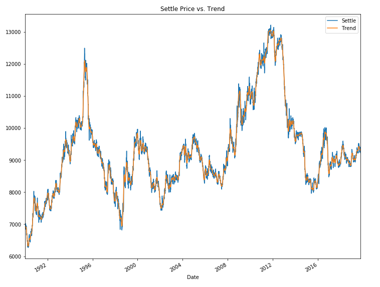
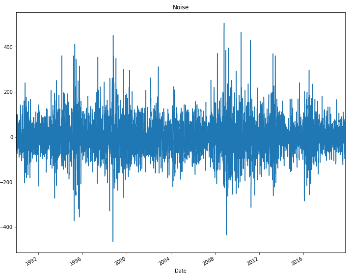
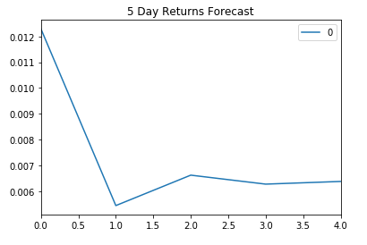
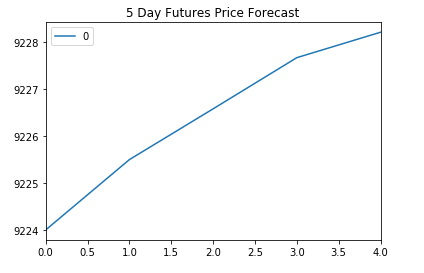
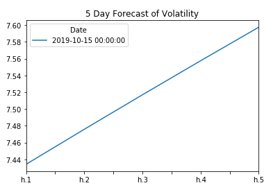
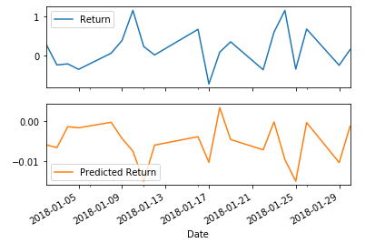

# Time-Series-Homework
# James Phalen

## This is a study of the Yen versus the dollar and if market movements in the Yen could create a buying opportunitiy based on time-series analysis.

## The yen data was first run though a Hodrick-Prescott Filter to identify trend and noise

## Next was the use of the ARMA model, which based on the p-value, was not a good fit because the p-value was above the 0.05 threshold, which means that the results are not significant enough to consider.

## Next was the ARMIA model, which predicted the Yen decreasing in value versus the dollar.  More yen per dollar is a decrease in yen value versus the dollar.

## Next was the GARCH model to predict near-term volatility:

## Conclusions of time-series analysis:

1. The time series from the ARIMA model indicates that it is best to buy the yen at a later date since it will decrese in value relative to the dollar.

1. The risk of the yen is expected to increase steadily over the next 5 days according to the GARCH model.

1. Evaluating the models based on P values indicates that the models cannot be relied on since they have not found anything statistically significant in their data.

# Regression Analysis

## The last model used was an SKLearn linear regression model to predict the Yen futures settlments.

## Conclusion of regression model:

1. Based on root mean square error, the model performed better on out-of-sample data, because the RMSE was lower by about -0.15.  
1. The results of the model using both trained and test data is that the root mean squared error is high for both, meaning that residual differences from the regression line of each set is high, making the regression line a poor match.  
1. I would not rely on the predictions of this model for trading.
